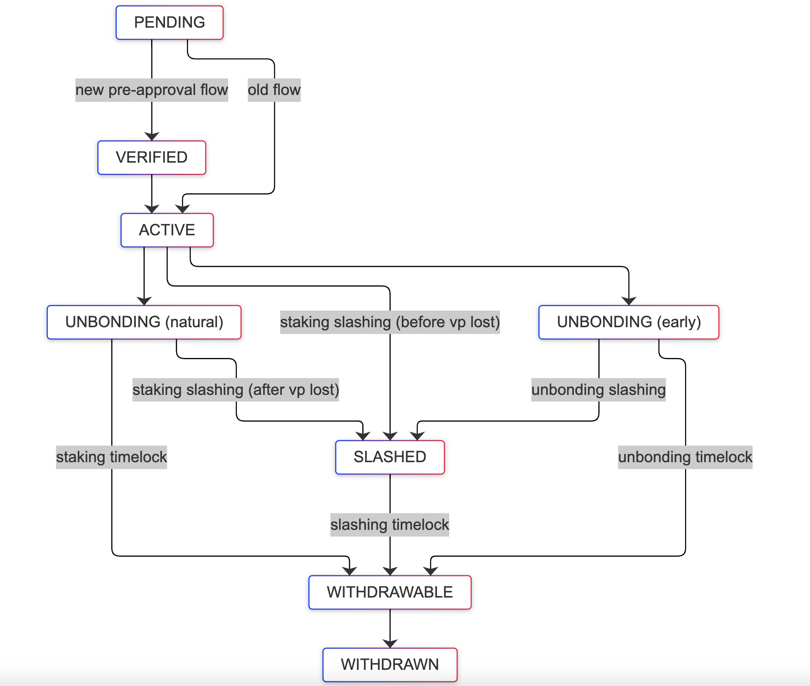

# Delegation Lifecycle

## State Transition Diagram

## Staking Output Spent

### 1. Timelock Path
**Flow**  
`Pending -> Verified -> Active -> Unbonding(timelock) -> Withdrawable -> Withdrawn`

**Description**  
- Normal delegation lifecycle
- Staking output spent via timelock path

---

### 2. Slashing Path
**Flow**  
`Pending -> Verified -> Active -> Slashed -> Withdrawable -> Withdrawn`

**Description**  
- Staking output spent via slashing path
- Occurs when finality provider is slashed

---

### 3. Early Unbonding Path

When unbonding transaction is submitted to Bitcoin:

#### a. Unbonding Output Spent via Timelock
**Flow**  
`Pending -> Verified -> Active -> Unbonding(early_unbonding) -> Withdrawable -> Withdrawn`

#### b. Unbonding Output Spent via Slashing
**Flow**  
`Pending -> Verified -> Active -> Unbonding(early_unbonding) -> Slashed -> Withdrawable -> Withdrawn`

---

## Special Cases

### 1. When BTC notifier is faster than Babylon events and expiry checker

**Flows**  
`Pending -> Verified -> Active -> Withdrawn` (skipping Unbonding(timelock), Withdrawable)  
`Pending -> Verified -> Active -> Slashed -> Withdrawn` (skipping Unbonding(timelock), Withdrawable)

More cases possible.

**Description**  
- BTC notifier detects state changes before Babylon events
- Results in skipping intermediate states

---

### 2. When staker forgets to withdraw
**Flows**  
`Pending -> Verified -> Active -> Unbonding(timelock) -> Withdrawable -> Slashed -> Withdrawable -> Withdrawn`

`Pending -> Verified -> Active -> Unbonding(early_unbonding) -> Withdrawable -> Slashed -> Withdrawable -> Withdrawn`

**Description**  
- If any funds are left in staking or unbonding output, they will be subject to slashing (even if the timelock has expired)
