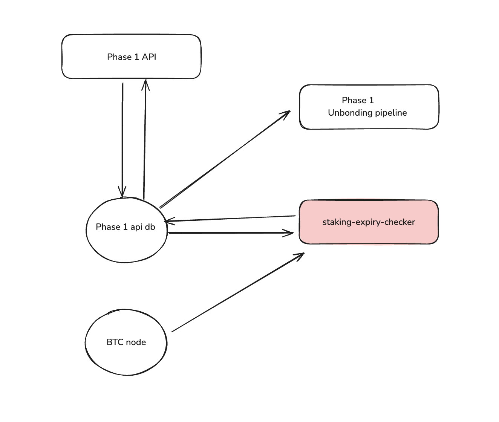

# Staking Expiry Checker

## Overview

The **Babylon Staking Expiry Checker** is a service that manages unbonding and withdrawal processes for Phase 1 delegations that haven't transitioned to Phase 2.

### Key Responsibilities

1. **Expiry Monitoring**: Identify when staking/unbonding timelock has expired, so delegation can be marked as Unbonded
2. **Unbonding Detection**: Identify when unbonding tx appeared in BTC, so delegation can be marked as Unbonding
3. **Withdrawal Tracking**: Identify when withdrawal tx appeared in BTC (staking/unbonding output has been spent through timelock path), and mark delegation as Withdrawn

## Architecture



The Staking Expiry Checker shares a database with other Phase 1 services and operates independently:

- **Shared MongoDB Database**: 
  - Read/Write access to the same database used by    Phase 1 API
  - Monitors and updates delegation states
- **Bitcoin Node**: Monitors BTC transactions for unbonding and withdrawal events

## Service Components

### 1. BTC Subscriber Poller
- Subscribes to Bitcoin spend notifications
- Monitors:
  - Staking transaction spends
  - Unbonding transaction spends
- Updates delegation states in shared database

### 2. Expiry Checker Poller
- Polls timelock queue table
- Identifies delegations with expired staking/unbonding timelocks
- Updates delegation status to "Unbonded" when timelock expires

## Phase 1 to Phase 2 Transition

### Pre-requisites for Phase 2 Migration

1. **Service Shutdown**
   - Stop [Phase 1 Staking Indexer](https://github.com/babylonlabs-io/staking-indexer) service
   - This must be done before starting Phase 2 Staking Expiry Checker

2. **Database Migration**
   - Copy Phase 1 API database to Phase 2 API database
   - Required for Expiry Checker to track legacy/Phase 1 delegations

### Configuration Changes

**Phase 1 Configuration (Legacy)**

Reference: [`phase-1-testnet/values.yaml`](https://github.com/babylonlabs-io/babylon-service-deployment/blob/13d57da2b20cd7b7d2ca3462506dfc3972230ad2/staking-expiry-checker/testnet/values.yaml#L45-L70)
```yaml
poller:
  interval: 60s
  log-level: debug
db:
  username: MONGODB_USER
  password: MONGODB_PASSWORD
  address: MONGODB_URL
  db-name: staking-api-service
btc:
  endpoint: BTC_URL
  disable-tls: true
  net-params: testnet
  rpc-user: BTC_USER
  rpc-pass: BTC_PASS
queue:
  queue_user: RABBITMQ_USER
  queue_password: RABBITMQ_PASSWORD
  url: RABBITMQ_URL
  processing_timeout: 5
  msg_max_retry_attempts: 10
  requeue_delay_time: 300
  queue_type: quorum
metrics:
  host: 0.0.0.0
  port: 2112
```

**Phase 2 Configuration (Current)**

Reference: [`phase-2-testnet/values.yaml`](https://github.com/babylonlabs-io/babylon-dapp-deployment/blob/6d50f18cfb7f6c46c740d2a2be2dad1f4d615353/staking-expiry-checker/phase-2-testnet/values.yaml#L41-L72)
```yaml
pollers:
  log-level: debug
  expiry-checker:
    interval: 1m
    timeout: 15m
  btc-subscriber:
    interval: 1m
    timeout: 30m
db:
  username: MONGODB_EXPIRY_USER
  password: MONGODB_EXPIRY_PASSWORD
  address: MONGODB_URL
  db-name: staking-api-service
  max-pagination-limit: 500
btc: 
  rpchost: BTC_URL
  rpcuser: BTC_USER
  rpcpass: BTC_PASS
  disable-tls: true
  prunednodemaxpeers: 0
  blockpollinginterval: 30s
  txpollinginterval: 10s
  txpollingintervaljitter: 0.5
  blockcachesize: 20971520
  maxretrytimes: 5
  retryinterval: 500ms
  netparams: signet
metrics:
  host: 0.0.0.0
  port: 2112
```

### Resource Requirements
- **Memory**: Minimum 2GB RAM recommended (observed ~1.5GB usage in testnet) 
Reference: [Grafana Dashboard](https://grafana.tooling.babylonlabs.io/goto/JXd8HgFNg?orgId=1)

## Installation & Setup

### Requirements

- **Go**: Version `1.23.1` or higher is required.
- **MongoDB**: A MongoDB instance with replica sets enabled is required

1. Clone the repository

```bash
git clone git@github.com:babylonlabs-io/staking-expiry-checker.git
cd staking-expiry-checker
```

2. Install dependencies

```bash
go mod tidy
```

3. Run the service

```bash
make run-local
```